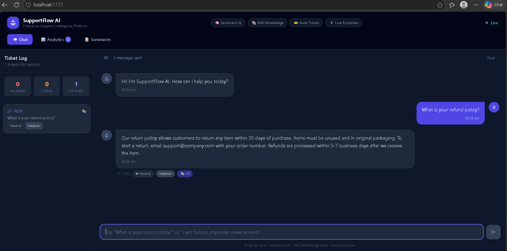
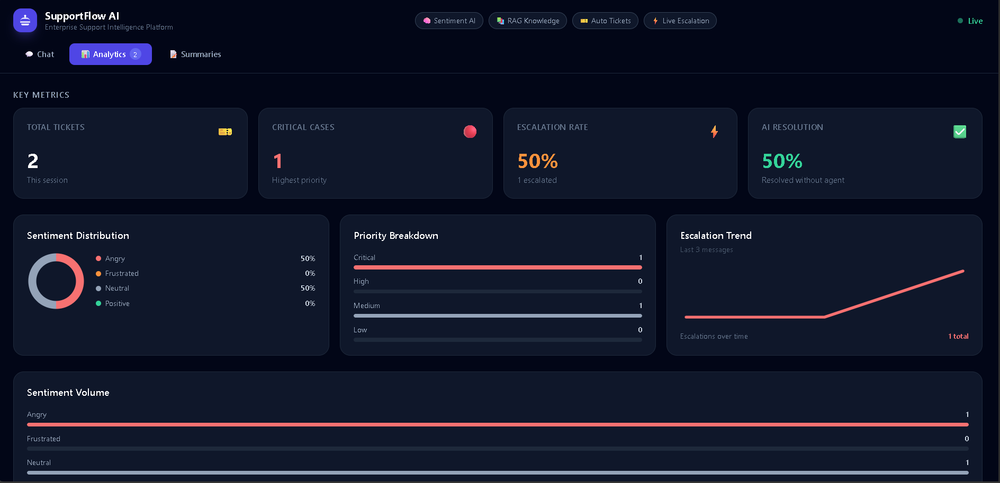
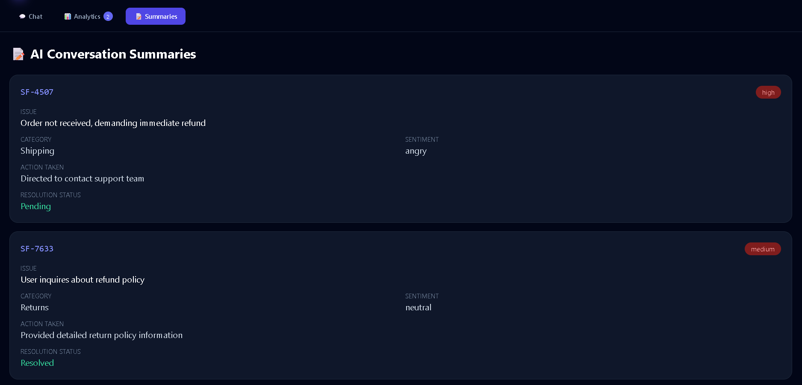
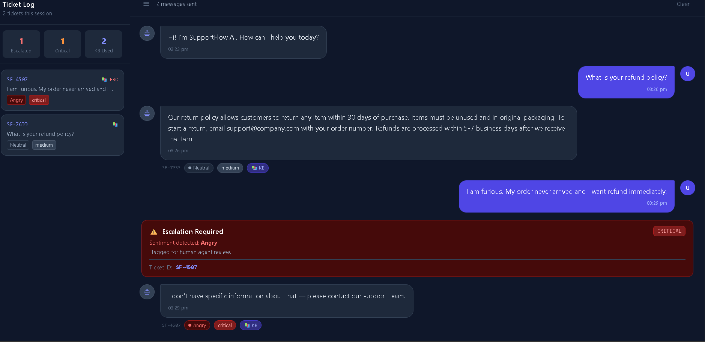

# SupportFlow AI

## Autonomous AI-Powered Customer Support Intelligence Platform

SupportFlow AI is an enterprise-grade AI-powered customer support intelligence platform built for FlowZint AI Hackathon 2026.

It combines Retrieval-Augmented Generation (RAG), sentiment-aware escalation workflows, analytics dashboards, and AI conversation summaries to automate and improve customer support operations.

---

# Project Overview

Modern customer support systems often struggle with:

- Slow response times
- Repetitive customer queries
- Poor escalation workflows
- Lack of sentiment awareness
- Manual ticket handling

SupportFlow AI solves these challenges using intelligent AI-powered workflows that automate support operations while improving customer experience.

---

# Core Features

- AI-powered customer support chatbot
- Retrieval-Augmented Generation (RAG) knowledge system
- Sentiment-aware escalation workflows
- Automated ticket generation
- AI conversation summaries
- Real-time support analytics dashboard
- Intelligent priority classification
- Knowledge-base grounded responses
- Live activity monitoring
- Enterprise-grade dark dashboard UI
- FastAPI backend architecture
- React frontend chat interface

---

# AI Capabilities

- Retrieval-Augmented Generation (RAG)
- Sentiment Analysis
- Escalation Detection
- Intelligent Ticket Classification
- AI Conversation Summarization
- Enterprise Support Analytics
- Knowledge Base Grounding

---

# System Architecture

User Query  
↓  
React Frontend  
↓  
FastAPI Backend  
↓  
RAG Knowledge Retrieval  
↓  
Sentiment Analysis Engine  
↓  
Priority Classification  
↓  
AI Response Generation  
↓  
Conversation Summary Engine  
↓  
Analytics Dashboard

---

# Tech Stack

## Frontend
- React
- Vite
- Tailwind CSS

## Backend
- FastAPI
- Python

## AI & APIs
- OpenRouter API
- GPT-3.5 Turbo

---

# Current Features Implemented

- Frontend setup completed
- Backend architecture completed
- AI chat endpoint working
- Frontend-backend integration completed
- Working AI chatbot MVP completed
- RAG knowledge retrieval implemented
- Sentiment analysis implemented
- Escalation workflow implemented
- Ticket generation system implemented
- Analytics dashboard implemented
- AI conversation summaries implemented
- Enterprise dashboard UI completed

---

# Analytics Features

- Sentiment distribution tracking
- Escalation monitoring
- Priority breakdown charts
- Live activity feed
- KB-assisted response tracking
- AI auto-resolution metrics

---

# Conversation Intelligence Features

- AI-generated issue summaries
- Category classification
- Sentiment detection
- Resolution status tracking
- Action-taken analysis
- Ticket lifecycle monitoring

---

# Planned Enhancements

- Multi-agent workflow orchestration
- Customer support automation pipelines
- Advanced analytics visualizations
- Admin management dashboard
- Cloud deployment and monitoring
- Voice-based support assistant

---

# Screenshots

## Chat Interface


---

## Analytics Dashboard


---

## AI Conversation Summaries


---

## Escalation Workflow


---

# Setup Instructions

## Backend

```bash
cd backend
.\venv\Scripts\Activate.ps1
uvicorn app.main:app --reload --port 8000
```

## Frontend

```bash
cd frontend
npm install
npm run dev
```

---

# Future Vision

SupportFlow AI aims to evolve into a complete enterprise AI support operations platform capable of:

- Intelligent support automation
- Autonomous ticket routing
- AI-powered support analytics
- Multi-agent orchestration
- Customer experience optimization

---

# Author

Poornima Palla

---

# Hackathon

Built for:
FlowZint AI Hackathon 2026
```