<p align="center">
  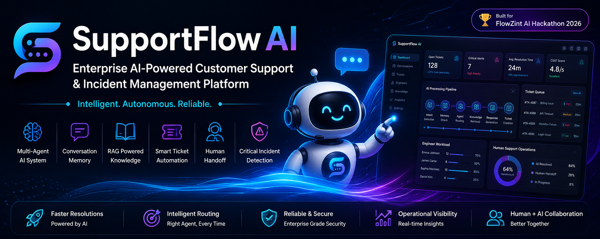
</p>

<h1 align="center">SupportFlow AI</h1>

<p align="center">
  <b>Enterprise AI-Powered Customer Support & Incident Management Platform</b>
</p>

<p align="center">
  Multi-agent AI orchestration for enterprise-grade customer support — from intent detection to engineer resolution.
</p>

<p align="center">
  
  
  
  
  
  
</p>

<p align="center">
  
  
  
</p>

<p align="center">
  <a href="#-key-features">Features</a> •
  <a href="#-system-architecture">Architecture</a> •
  <a href="#-installation">Installation</a> •
  <a href="#-api-overview">API</a> •
  <a href="#-demo-scenarios">Demo</a> •
  <a href="#-license">License</a>
</p>

---

## 📖 Overview

**SupportFlow AI** is an enterprise-grade customer support platform that replaces the traditional single-chatbot model with a coordinated system of specialized AI agents. Rather than forcing every conversation through one general-purpose assistant, SupportFlow AI classifies intent, routes the request to the right specialist agent, retrieves grounded context from a knowledge base, and — when the situation calls for it — hands the case off to a human engineer with full context already attached.

It is built for organizations that need support automation they can actually trust in production: every AI decision is logged, every escalation is explainable, and every ticket carries the full reasoning trail that led to it.

---

## ❗ Problem Statement

Enterprise support teams are stuck between two bad options:

- **Generic chatbots** that handle FAQs well but collapse the moment a request touches billing, platform access, integrations, or anything outside a narrow script.
- **Fully human support queues** that scale linearly with headcount, are expensive to run 24/7, and leave customers waiting for issues that could have been resolved instantly.

Meanwhile, the tools that *do* use AI often behave as a black box — support leads can't see *why* the AI reached a conclusion, engineers receive tickets with no context, and there's no reliable way to detect when a request is actually a critical incident until a human happens to notice.

---

## ✅ Solution

SupportFlow AI addresses this with a **multi-agent, memory-aware, retrieval-grounded architecture**:

- Requests are classified and routed to the specialist agent best equipped to handle them.
- Every agent shares access to conversation memory and a RAG-backed knowledge base, so answers are grounded in real documentation — not hallucinated.
- Every AI decision produces a transparent **AI Decision Summary**, so support leads can audit exactly why the system did what it did.
- When confidence is low, the request escalates cleanly to a human, with the ticket and full context already assembled.
- Critical incidents are automatically flagged and prioritized before they become outages.

The result is a platform that automates the majority of support volume while keeping humans firmly in control of anything that matters.

---

## 🌟 Why SupportFlow AI

| | |
|---|---|
| 🧠 **Multi-agent, not single-bot** | Five specialized agents instead of one overloaded assistant |
| 🔍 **Grounded, not hallucinated** | RAG-backed responses sourced from your actual knowledge base |
| 🧾 **Transparent, not a black box** | Every decision comes with a human-readable AI Decision Summary |
| 🤝 **Human-in-the-loop by design** | Clean escalation path with full context handoff, not a dead end |
| 🚨 **Incident-aware** | Automatically detects and escalates critical incidents |
| 📊 **Operationally observable** | A real-time dashboard for ticket queues, workloads, and pipeline health |

---

## 🚀 Key Features

- 🎯 **Intelligent Intent Detection** — classifies incoming requests before any agent is invoked
- 🧭 **AI Agent Routing** — dispatches each request to the correct specialist agent
- 🤖 **Multi-Agent Collaboration** — Workflow, API Integration, Platform Access, Billing & Credits, and Enterprise Support agents working in concert
- 🧠 **Conversation Memory** — maintains session and cross-turn context
- 📚 **Retrieval-Augmented Generation (RAG)** — grounds responses in a live knowledge base
- 🧾 **AI Decision Summary** — explains every AI decision in plain language
- ⚙️ **AI Processing Pipeline** — full visibility into each processing stage and its latency
- 🎫 **Smart Ticket Generation** — auto-structures tickets from resolved or escalated conversations
- 🧑‍💻 **Human Handoff** — seamless escalation with complete context transfer
- 🛠️ **Engineer Assignment** — routes tickets to the right engineer based on skill and load
- 🚨 **Critical Incident Detection** — flags high-severity issues automatically
- 📊 **Enterprise Dashboard** — a unified operational view of the entire platform
- 📥 **Ticket Queue** — live view of open, pending, and resolved tickets
- 👷 **Human Support Operations** — agent status and support queue visibility
- 📈 **Engineer Workload** — real-time capacity tracking per engineer

---

## 📊 Feature Comparison Table

| Capability | Traditional Chatbot | Generic AI Wrapper | **SupportFlow AI** |
|---|:---:|:---:|:---:|
| Intent-based routing | ❌ | ⚠️ Limited | ✅ |
| Multiple specialized agents | ❌ | ❌ | ✅ |
| Conversation memory | ⚠️ Session-only | ⚠️ Basic | ✅ Full context |
| Grounded responses (RAG) | ❌ | ⚠️ Sometimes | ✅ |
| Explainable AI decisions | ❌ | ❌ | ✅ AI Decision Summary |
| Smart ticket generation | ❌ | ❌ | ✅ |
| Human handoff with context | ⚠️ Manual | ⚠️ Manual | ✅ Automatic |
| Critical incident detection | ❌ | ❌ | ✅ |
| Operational dashboard | ❌ | ❌ | ✅ |
| Engineer workload visibility | ❌ | ❌ | ✅ |

---

## 🏗️ System Architecture

SupportFlow AI is organized into six distinct layers, each with a single, well-defined responsibility. This separation keeps the system debuggable, testable, and easy to extend with new agents or data sources.

**Client Layer**
The React + Tailwind frontend that end users interact with. It handles chat rendering, session state, and communicates exclusively with the backend over a versioned REST API.

**Backend Layer**
A FastAPI service that acts as the single entry point for every request. It handles authentication, request orchestration, intent classification, and coordination between conversation memory and the agent router.

**AI Layer**
The reasoning core of the platform. This layer contains the AI Agent Router and its five specialist agents (Workflow, API Integration, Platform Access, Billing & Credits, Enterprise Support), all backed by an OpenRouter-hosted Llama 3.3 70B model.

**Knowledge Layer**
A retrieval-augmented generation (RAG) pipeline backed by a vector-indexed knowledge base. Every agent queries this layer before generating a response, ensuring answers are grounded in real documentation rather than model memory alone.

**Ticket Layer**
Converts resolved or escalated conversations into structured tickets, detects critical incidents, and manages the human handoff process — including assigning tickets to the appropriate engineer.

**Dashboard Layer**
The operational control tower: AI decision summaries, the processing pipeline trace, execution timelines, the ticket queue, human support operations, and engineer workload — all in one real-time view.

<p align="center">
  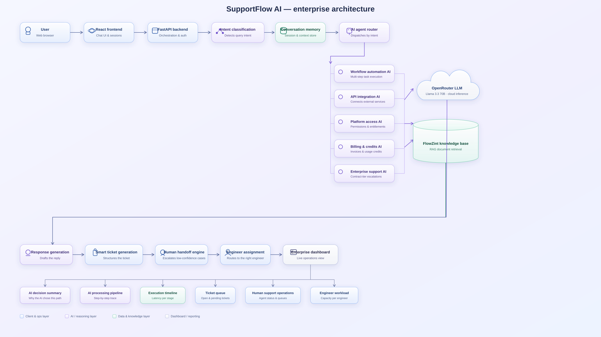
</p>

---

## 🔄 Complete AI Workflow

1. User submits a request through the **React frontend**
2. The **FastAPI backend** receives and authenticates the request
3. **Intent classification** determines the nature of the request
4. **Conversation memory** is loaded to provide full context
5. The **AI Agent Router** dispatches the request to the correct specialist agent
6. The specialist agent queries the **RAG knowledge base** and the **OpenRouter LLM (Llama 3.3 70B)**
7. A response is generated and an **AI Decision Summary** is recorded
8. If confidence is high, the response is returned directly to the user
9. If confidence is low or the request is sensitive, **Smart Ticket Generation** creates a ticket
10. The **Human Handoff Engine** escalates the ticket with full context
11. **Engineer Assignment** routes the ticket to the right engineer
12. Everything is reflected live on the **Enterprise Dashboard**

<p align="center">
  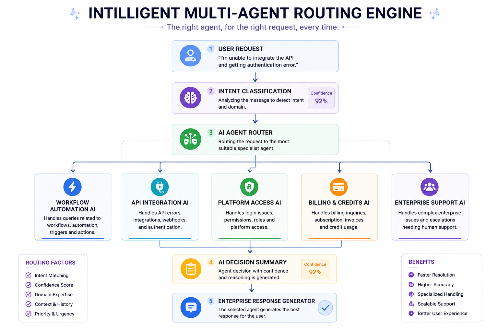
</p>

---

## ⚙️ AI Processing Pipeline

Every request that enters SupportFlow AI moves through a fully traceable pipeline — no step is a black box. Each stage records its input, output, latency, and confidence score, so the entire lifecycle of a request can be replayed and audited after the fact.

Stages tracked in the pipeline:

- Intent classification
- Memory retrieval
- Agent selection
- Knowledge base retrieval
- LLM generation
- Confidence scoring
- Ticket creation (if applicable)

<p align="center">
  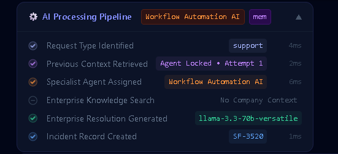
</p>

---

## 🤝 Human Handoff

Not every request should be resolved by AI, and SupportFlow AI is built to know the difference. The Human Handoff Engine evaluates confidence scores, sensitive categories (billing disputes, security, compliance), explicit user requests for a human, and repeated failed resolution attempts.

When an escalation is triggered, the engine packages a complete context brief for the receiving engineer: the original query, what the AI attempted, why it escalated, and any relevant account or ticket history — so no one starts from a blank page.

<p align="center">
  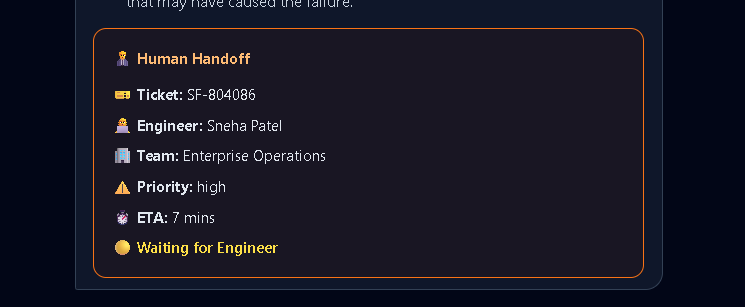
</p>

---

## 🧠 Conversation Memory

SupportFlow AI maintains persistent, structured memory across a conversation and across sessions. This allows agents to reference earlier context, avoid asking users to repeat themselves, and hand off a case to a human without losing any history.

Memory is scoped per user and per session, and is available to every agent in the Multi-Agent Router — ensuring a consistent experience regardless of which specialist agent responds.

<p align="center">
  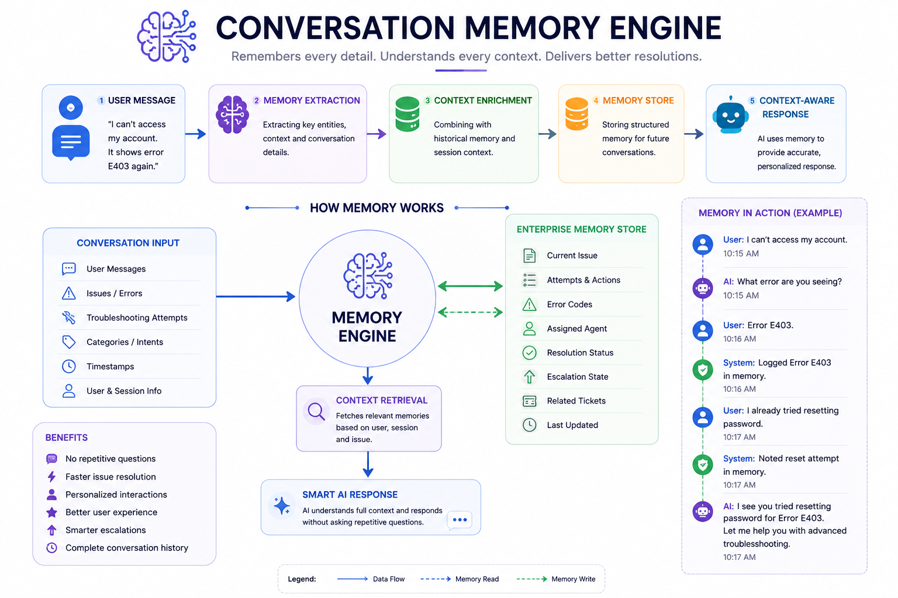
</p>

---

## 🤖 Multi-Agent Collaboration

Instead of one generalized model attempting to handle every category of request, SupportFlow AI routes to five specialist agents, each scoped to a specific domain:

| Agent | Responsibility |
|---|---|
| **Workflow Automation AI** | Executes multi-step operational tasks |
| **API Integration AI** | Connects and queries external services |
| **Platform Access AI** | Handles permissions and entitlement questions |
| **Billing & Credits AI** | Resolves invoices, usage, and credit issues |
| **Enterprise Support AI** | Handles contract-tier and high-priority escalations |

Agents share conversation memory and the RAG knowledge base, so handoffs between agents within the same conversation are seamless.

<p align="center">
  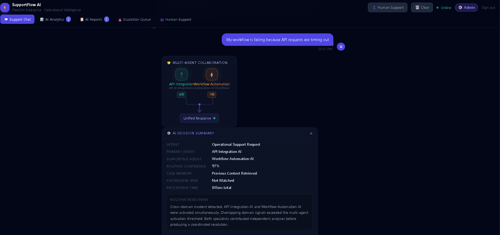
</p>

---

## 📚 Retrieval-Augmented Generation (RAG)

Every specialist agent grounds its responses using a RAG pipeline over the FlowZint knowledge base — internal documentation, past resolutions, product manuals, and policy documents. This dramatically reduces hallucination and ensures answers reflect the organization's actual product and policies, not just general model knowledge.

The retrieval layer performs semantic search over vector-indexed documents and returns the most relevant passages, which are injected into the prompt sent to the OpenRouter LLM.

<p align="center">
  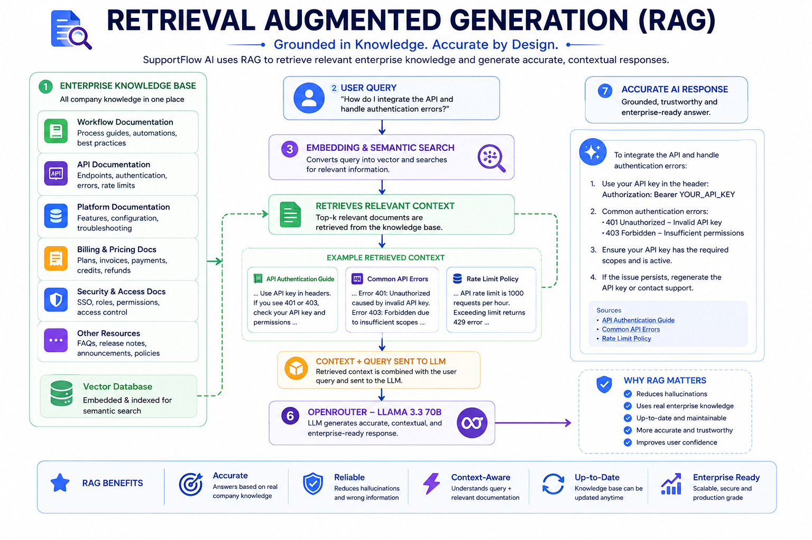
</p>

---

## 🧾 AI Decision Summary

For every AI-generated response, SupportFlow AI produces a plain-language summary explaining:

- Which intent was detected
- Which agent handled the request
- Which knowledge sources were retrieved
- The model's confidence in its own response
- Whether escalation was considered, and why

This turns the AI from a black box into an auditable system that support leads can trust and review.

<p align="center">
  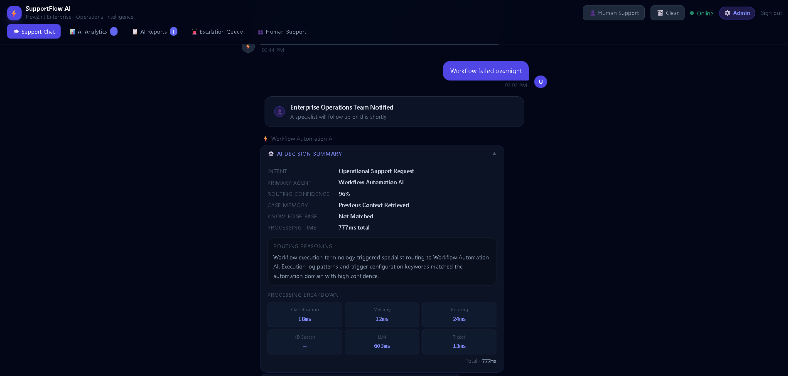
</p>

---

## 📊 Enterprise Dashboard

The Enterprise Dashboard is the operational control center for the entire platform. It brings together AI decision summaries, the processing pipeline, execution timelines, the ticket queue, human support operations, and engineer workload into a single live view.

<p align="center">
  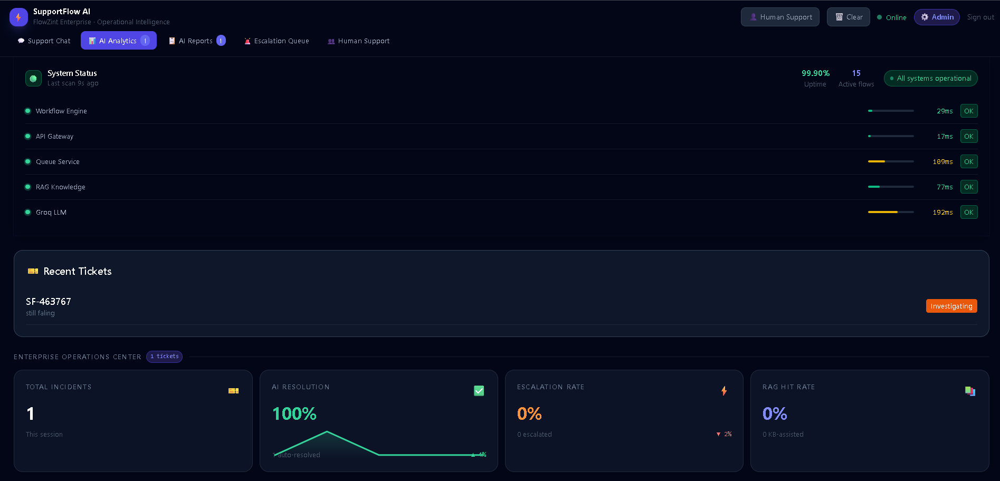
</p>

---

## 🎫 Ticket Queue

Every ticket generated by the platform — whether auto-resolved, escalated, or flagged as critical — is visible in a live, filterable queue. Support leads can see ticket status, priority, associated agent, and time-to-resolution at a glance.

<p align="center">
  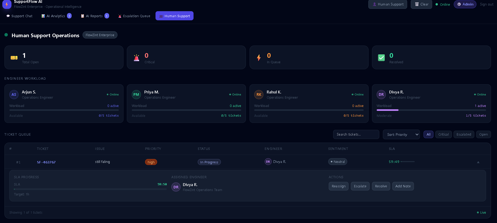
</p>

<p align="center">
  
</p>

---

## 👷 Engineer Workload

SupportFlow AI tracks real-time capacity across the engineering team, so tickets are assigned based on actual availability rather than a static round-robin. The dashboard surfaces current load, active tickets, and average resolution time per engineer, helping managers rebalance work before anyone is overloaded.

---

## 🎬 Demo Scenarios

**Scenario 1 — Routine billing question**
A user asks about an unexpected charge. Intent classification routes the request to the Billing & Credits AI, which retrieves the relevant invoice data via RAG and resolves the question directly — no ticket required.

**Scenario 2 — Platform access issue**
A user reports being locked out of a feature. The Platform Access AI checks entitlements, resolves a permissions mismatch, and logs the resolution with a full AI Decision Summary.

**Scenario 3 — Low-confidence escalation**
A user describes an ambiguous integration failure. The API Integration AI's confidence score falls below threshold, triggering the Human Handoff Engine, which packages the context and routes it to an available engineer.

**Scenario 4 — Critical incident**
Multiple users report the same outage within minutes. Critical Incident Detection flags the pattern, escalates immediately, and assigns the highest-priority engineer available.

---

## 🖼️ Screenshots

<p align="center">
  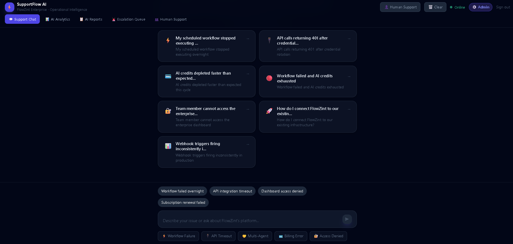
</p>

<p align="center">
  
</p>

<p align="center">
  
</p>

---

## 🛠️ Tech Stack

| Layer | Technology |
|---|---|
| **Frontend** | React, Tailwind CSS, JavaScript, Vite |
| **Backend** | FastAPI, Python |
| **AI / LLM** | OpenRouter, Llama 3.3 70B, Prompt Engineering |
| **Knowledge Layer** | Retrieval-Augmented Generation (RAG) |
| **Core Features** | Multi-Agent Routing, Conversation Memory, Ticket Engine, Human Escalation |

---

## 📁 Folder Structure

```
supportflow-ai/
├── backend/
│   ├── app/
│   │   ├── agents/
│   │   │   ├── workflow_agent.py
│   │   │   ├── api_integration_agent.py
│   │   │   ├── platform_access_agent.py
│   │   │   ├── billing_agent.py
│   │   │   └── enterprise_agent.py
│   │   ├── core/
│   │   │   ├── intent_classifier.py
│   │   │   ├── agent_router.py
│   │   │   └── memory.py
│   │   ├── rag/
│   │   │   ├── retriever.py
│   │   │   └── vector_store.py
│   │   ├── tickets/
│   │   │   ├── ticket_generator.py
│   │   │   ├── handoff_engine.py
│   │   │   └── incident_detector.py
│   │   ├── api/
│   │   │   └── routes.py
│   │   └── main.py
│   ├── requirements.txt
│   └── .env.example
├── frontend/
│   ├── src/
│   │   ├── components/
│   │   ├── pages/
│   │   ├── hooks/
│   │   └── App.jsx
│   ├── package.json
│   └── vite.config.js
├── images/
│   ├── banner.png
│   ├── architecture.png
│   └── ...
├── docs/
└── README.md
```

---

## 📦 Installation

### Prerequisites

- Python 3.11+
- Node.js 18+
- An OpenRouter API key

Clone the repository:

```bash
git clone https://github.com/your-org/supportflow-ai.git
cd supportflow-ai
```

---

## 🔧 Backend Setup

```bash
cd backend
python -m venv venv
source venv/bin/activate      # On Windows: venv\Scripts\activate
pip install -r requirements.txt
cp .env.example .env          # Add your OpenRouter API key
uvicorn app.main:app --reload --port 8000
```

The backend will be available at `http://localhost:8000`.

---

## 💻 Frontend Setup

```bash
cd frontend
npm install
npm run dev
```

The frontend will be available at `http://localhost:5173`.

---

## 🔑 Environment Variables

Create a `.env` file inside `backend/` with the following variables:

| Variable | Description | Required |
|---|---|:---:|
| `OPENROUTER_API_KEY` | API key for OpenRouter LLM access | ✅ |
| `LLM_MODEL` | Model identifier (e.g. `llama-3.3-70b`) | ✅ |
| `VECTOR_DB_URL` | Connection string for the RAG vector store | ✅ |
| `DATABASE_URL` | Connection string for the application database | ✅ |
| `JWT_SECRET` | Secret used to sign auth tokens | ✅ |
| `CORS_ORIGINS` | Allowed frontend origins | ⚠️ Optional |
| `LOG_LEVEL` | Logging verbosity (`info`, `debug`) | ⚠️ Optional |

---

## 🔌 API Overview

| Method | Endpoint | Description |
|---|---|---|
| `POST` | `/api/v1/chat` | Submit a user message and receive an AI-generated response |
| `GET` | `/api/v1/conversations/{id}` | Retrieve conversation history and memory |
| `POST` | `/api/v1/tickets` | Manually create a support ticket |
| `GET` | `/api/v1/tickets` | List all tickets with filters (status, priority, agent) |
| `GET` | `/api/v1/tickets/{id}` | Retrieve a single ticket, including its decision summary |
| `POST` | `/api/v1/handoff/{conversation_id}` | Manually trigger human handoff for a conversation |
| `GET` | `/api/v1/engineers/workload` | Retrieve current workload across engineers |
| `GET` | `/api/v1/dashboard/summary` | Retrieve aggregate metrics for the enterprise dashboard |
| `GET` | `/api/v1/pipeline/{request_id}` | Retrieve the full processing pipeline trace for a request |

All endpoints are versioned under `/api/v1` and require a valid bearer token, except for `/api/v1/chat` in demo mode.

---

## 🔮 Future Improvements

- 🌐 Multi-language support detection and response generation
- 🔐 Role-based access control for the Enterprise Dashboard
- 📞 Voice channel integration alongside chat
- 🧩 Plugin architecture for adding new specialist agents without redeploying core services
- 📈 Predictive engineer workload balancing using historical resolution data
- 🔄 Continuous fine-tuning loop based on human-corrected escalations
- 🗣️ Sentiment-aware escalation triggers

---

## 👥 Team

| Name | Role |
|---|---|
| *Your Name Here* | Full-Stack & AI Engineering |
| *Your Name Here* | Backend & Infrastructure |
| *Your Name Here* | Frontend & UX |

> Built for the **FlowZint AI Hackathon 2026**.

---

## 📄 License

This project is licensed under the **MIT License** — see the [LICENSE](LICENSE) file for details.

```
MIT License

Copyright (c) 2026 SupportFlow AI

Permission is hereby granted, free of charge, to any person obtaining a copy
of this software and associated documentation files (the "Software"), to deal
in the Software without restriction, including without limitation the rights
to use, copy, modify, merge, publish, distribute, sublicense, and/or sell
copies of the Software, subject to the following conditions:

The above copyright notice and this permission notice shall be included in
all copies or substantial portions of the Software.
```

---

## 🙏 Thank You

Thank you for taking the time to explore **SupportFlow AI**. This project was built to show what enterprise support looks like when AI agents collaborate, ground their answers in real knowledge, and know exactly when to bring a human into the loop.

We'd love your feedback, contributions, and stars ⭐ — and if you're a judge reading this at 2 a.m. during the FlowZint AI Hackathon 2026, thank you for your time. We hope it shows.

<p align="center">
  Made with care for the <b>FlowZint AI Hackathon 2026</b>
</p>
